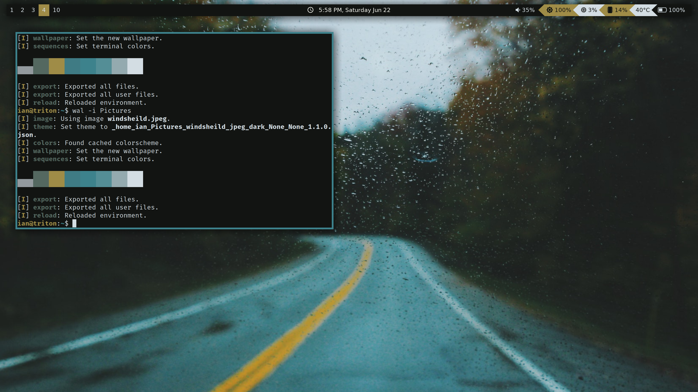

*under construction...*

# what this is
I plan on using this repository as a way to manage dotfiles, configs, install scripts and functionality scripts for my different machines. Currently what that means is a Pop_OS 19.04 install, with i3-gaps, compoton, nvim, zathura, rofi, polybar, ranger and among other software. Additionally this repo should included the necesary adjustments for hidpi displays.

In terms of workflow, I use my laptop for notetaking in LaTeX, reading pdfs, writing scientific and engineering code, CAD modeling, raspberryPi projects, and web browsing.

Eventually I hope to get this repository organized to the point with install scripts that someone using a debian based distrobution could easily replicate this system.

# scripts
Probably the most valubale part of this repository are the install and utility scripts that I've either cobbled together from the web or writen myself. I think using a keyboard based tiling window manger and lightweight compositor like i3 and compton can be a great way to optimize preformace, both in human and hardware terms. The only problem is that i3 out of the box can lack basic functionality like hidpi scaling, brightness and volume controls, and san gaps it can be down right claustrophobic. Additonally, I struggled emensely at first getting i3-gaps and polybar to install on a ubuntu based system. My goal with this repo is to allow someone with an debian based system to clone in, and have a functioning i3 enviroment within about 10 minutes. Anways there are scripts here for volume control, brightness control, a lightweight screen locker, and controling bluetooth device connections, and built into the i3 config I have a mode for controling power usage profiles.

# screenshots

